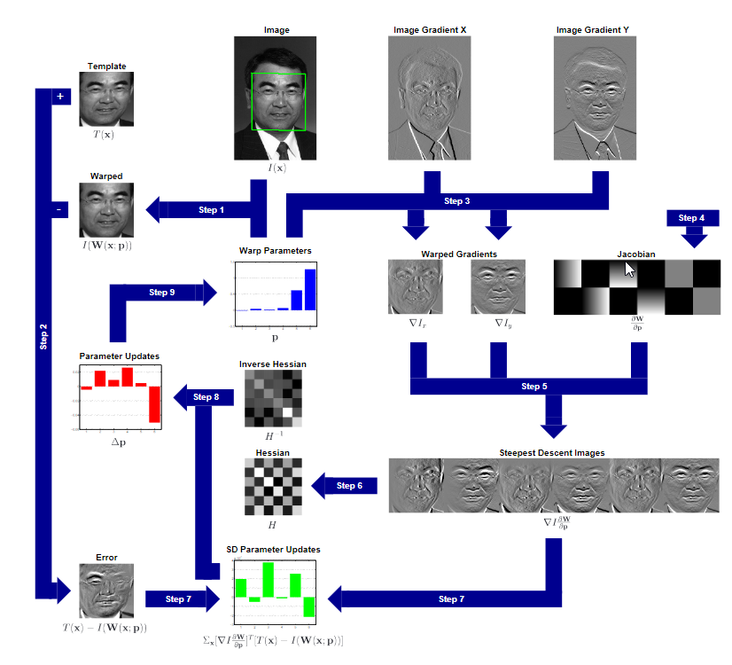
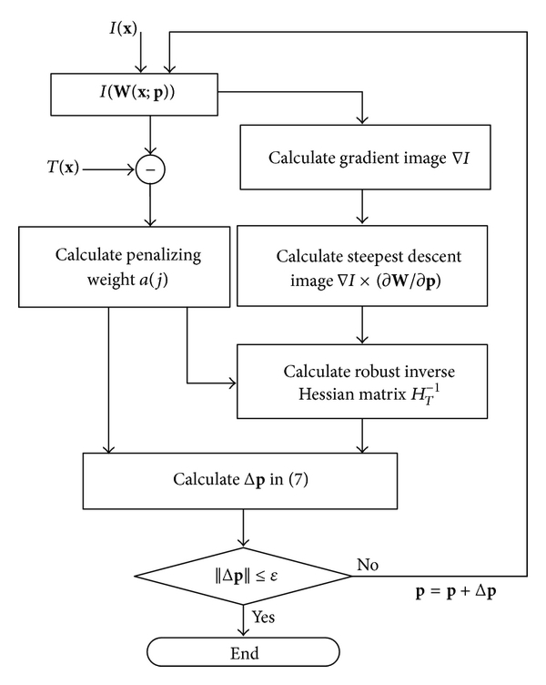
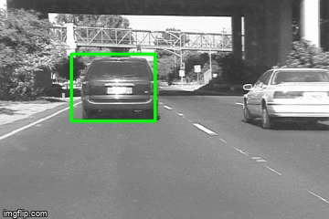
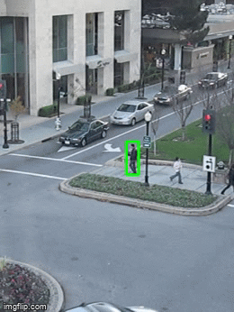
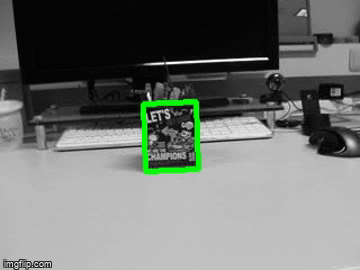

# Lucas Kanade Template Tracker

# Introduction
In this project I have implemented a Lucas-Kanade (LK) template tracker.
To initialize the tracker you need to define a template by drawing a
bounding box around the object to be tracked in the first frame of the
video. For each of the subsequent frames the tracker will update an affine
transform that warps the current frame so that the template in the first
frame is aligned with the warped current frame.

At the core of the algorithm is a function affineLKtracker(img, tmp, rect,
pprev). This function will get as input a grayscale image of the current
frame (img), the template image (tmp), the bounding box (rect) that
marks the template region in tmp, and the parameters pprev of the
previous warping. The function will iteratively compute the new warping
parameters pnew, and return these parameters.

## Author
 - Ishan Patel

## License
License file can be found [here](https://github.com/Ip-umd/Lucas-Kanade-Template-Tracker/blob/master/LICENSE)

```
BSD 3-Clause License

Copyright (c) 2020, Ishan Patel
All rights reserved.

Redistribution and use in source and binary forms, with or without
modification, are permitted provided that the following conditions are met:

1. Redistributions of source code must retain the above copyright notice, this
   list of conditions and the following disclaimer.

2. Redistributions in binary form must reproduce the above copyright notice,
   this list of conditions and the following disclaimer in the documentation
   and/or other materials provided with the distribution.

3. Neither the name of the copyright holder nor the names of its
   contributors may be used to endorse or promote products derived from
   this software without specific prior written permission.

THIS SOFTWARE IS PROVIDED BY THE COPYRIGHT HOLDERS AND CONTRIBUTORS "AS IS"
AND ANY EXPRESS OR IMPLIED WARRANTIES, INCLUDING, BUT NOT LIMITED TO, THE
IMPLIED WARRANTIES OF MERCHANTABILITY AND FITNESS FOR A PARTICULAR PURPOSE ARE
DISCLAIMED. IN NO EVENT SHALL THE COPYRIGHT HOLDER OR CONTRIBUTORS BE LIABLE
FOR ANY DIRECT, INDIRECT, INCIDENTAL, SPECIAL, EXEMPLARY, OR CONSEQUENTIAL
DAMAGES (INCLUDING, BUT NOT LIMITED TO, PROCUREMENT OF SUBSTITUTE GOODS OR
SERVICES; LOSS OF USE, DATA, OR PROFITS; OR BUSINESS INTERRUPTION) HOWEVER
CAUSED AND ON ANY THEORY OF LIABILITY, WHETHER IN CONTRACT, STRICT LIABILITY,
OR TORT (INCLUDING NEGLIGENCE OR OTHERWISE) ARISING IN ANY WAY OUT OF THE USE
OF THIS SOFTWARE, EVEN IF ADVISED OF THE POSSIBILITY OF SUCH DAMAGE.
```

# Algorithm


A schematic overview of the Lucas-Kanade algorithm. The image I is
warped with the current estimate of the warp in Step 1 and the result
subtracted from the template in Step 2 to yield the error image. The
gradient of I is warped in Step 3, the Jacobian is computed in Step 4,
and the two combined in Step 5 to give the steepest descent images. In
Step 6 the Hessian is computed from the steepest descent images. In Step
7 the steepest descent parameter updates are computed by dot producting
the error image with the steepest descent images. In Step 8 the Hessian
is inverted and multiplied by the steepest descent parameter updates to
get the final parameter updates p which are then added to the
parameters p in Step 9.

## Algorithm



## result





## OpenCV installation
```
Update packages
sudo apt-get update
sudo apt-get upgrade
```
We will install required dependencies
```
sudo apt-get install build-essential checkinstall cmake pkg-config yasm
sudo apt-get install git gfortran
sudo apt-get install libjpeg8-dev libjasper-dev libpng12-dev
 ```
If you are using Ubuntu 14.04
```
sudo apt-get install libtiff4-dev
```
If you are using Ubuntu 16.04
```
sudo apt-get install libtiff5-dev
```

```
sudo apt-get install libavcodec-dev libavformat-dev libswscale-dev libdc1394-22-dev
sudo apt-get install libxine2-dev libv4l-dev
sudo apt-get install libgstreamer0.10-dev libgstreamer-plugins-base0.10-dev
sudo apt-get install qt5-default libgtk2.0-dev libtbb-dev
sudo apt-get install libatlas-base-dev
sudo apt-get install libfaac-dev libmp3lame-dev libtheora-dev
sudo apt-get install libvorbis-dev libxvidcore-dev
sudo apt-get install libopencore-amrnb-dev libopencore-amrwb-dev
sudo apt-get install x264 v4l-utils
 ```
Optional dependencies
```
sudo apt-get install libprotobuf-dev protobuf-compiler
sudo apt-get install libgoogle-glog-dev libgflags-dev
sudo apt-get install libgphoto2-dev libeigen3-dev libhdf5-dev doxygen
```
Clone OpenCV and OpenCV_contrib
```
git clone https://github.com/opencv/opencv.git
cd opencv
git checkout 3.3.1
cd ..

git clone https://github.com/opencv/opencv_contrib.git
cd opencv_contrib
git checkout 3.3.1
cd ..
```
Make build directory
```
cd opencv
mkdir build
cd build
```
Run Cmake
```
cmake -D CMAKE_BUILD_TYPE=RELEASE \
      -D CMAKE_INSTALL_PREFIX=/usr/local \
      -D INSTALL_C_EXAMPLES=ON \
      -D INSTALL_PYTHON_EXAMPLES=ON \
      -D WITH_TBB=ON \
      -D WITH_V4L=ON \
      -D WITH_QT=ON \
      -D WITH_OPENGL=ON \
      -D OPENCV_EXTRA_MODULES_PATH=../../opencv_contrib/modules \
      -D BUILD_EXAMPLES=ON ..
```
Find out number of CPU cores in your machine
```
nproc

# substitute 4 by output of nproc
make -j4
sudo make install
sudo sh -c 'echo "/usr/local/lib" >> /etc/ld.so.conf.d/opencv.conf'
sudo ldconfig
```
For installation related issues.

A complete OpenCV installation guide in Ubuntu can be found [here](http://www.codebind.com/cpp-tutorial/install-opencv-ubuntu-cpp/).
